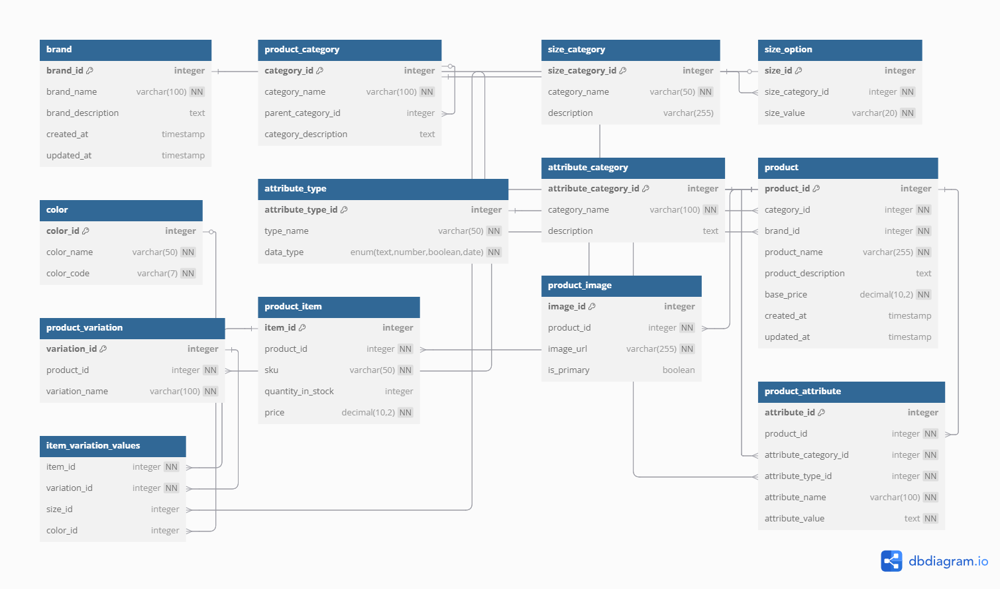

# E-commerce Database Design Project

## Overview

This project involves the design and implementation of a database for an e-commerce platform.  The goal is to create a robust and scalable database that can efficiently store and manage all the necessary data for an online store, including product information, categories, variations, and attributes.

## Project Goal

The primary objective is to master the art of database design by:

* Designing an Entity-Relationship Diagram (ERD).
* Building an e-commerce database from scratch.

## Project Description

This project requires you to design a database for an e-commerce platform.  The database will consist of several tables, each representing a key aspect of the platform.  The relationships between these tables will be defined in an ERD.  The database will be implemented using SQL.

## Instructions

1.  **Create an ERD:**
    * Clearly define all entities (tables) and their attributes.
    * Understand and document the relationships between tables.
    * Identify primary keys, foreign keys, and other constraints.
    * Use tools like Lucidchart, draw.io, dbdiagram.io, or MySQL Workbench.

2.  **Plan the Data Flow:**
    * Map out how data flows between entities.
    * Discuss how the database will be structured and implemented.
    * Consider data retrieval and manipulation for common e-commerce operations (e.g., browsing products, adding to cart, processing orders).

3.  **Group Collaboration:**
    * Work together on analysis, design, and implementation.
    * Ensure everyone understands every part of the project.
    * Share ideas, ask questions, and maintain strong teamwork.

4.  **Submission:**
    * Create a public GitHub repository.
    * Upload your final ERD and ecommerce.sql file.
    * Ensure everything is accessible to the reviewer.

## Group Collaboration Tips

* Stay connected and meet regularly.
* Use GitHub for version control, documentation, and teamwork.
* Track your progress, share updates, and troubleshoot together.
* Ensure everyone is in the loop.

## ERD 

## Database Tables

The following tables will be created for the e-commerce platform:

* **product_image:** Stores product image URLs or file references.
* **color:** Manages available color options.
* **product_category:** Classifies products into categories (e.g., clothing, electronics).
* **product:** Stores general product details (name, brand, base price).
* **product_item:** Represents purchasable items with specific variations (e.g., size, color).
* **brand:** Stores brand-related data.
* **product_variation:** Links a product to its variations (e.g., size, color).
* **size_category:** Groups sizes into categories (e.g., clothing sizes, shoe sizes).
* **size_option:** Lists specific sizes (e.g., S, M, L, 42).
* **product_attribute:** Stores custom attributes (e.g., material, weight).
* **attribute_category:** Groups attributes into categories (e.g., physical, technical).
* **attribute_type:** Defines types of attributes (e.g., text, number, boolean).

## SQL Implementation

The `ecommerce.sql` file contains the SQL statements to create the tables and define the database schema.  It can be used to set up the database in a MySQL or other compatible database system.

## Assumptions

* Product variations are based on size and color.
* Attributes are product-specific and categorized.
* Product images are stored as URLs.

## Technical Details

* **Database System:** MySQL
* **ERD Tool:** dbdiagram.io
* **Programming Language:** SQL

##  File Structure
* ├── ecommerce.sql
* └── README.md## Contribution

## Future Enhancements
* Implement user management (customers, administrators).
* Add order processing and management functionality.
* Incorporate a shopping cart and checkout system.
* Implement search and filtering capabilities.
* Add support for product reviews and ratings.
